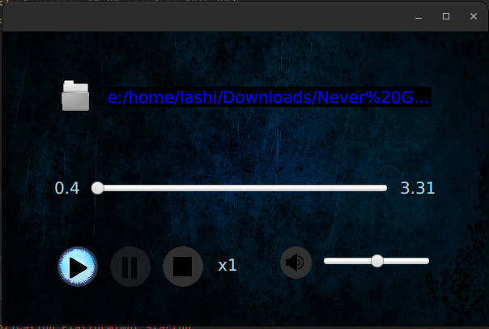

Audio Player App

This is a simple audio player application created using JavaFX. It allows you to play audio files, control playback, adjust volume, and more.

Technologies Used

- JavaFX
- Java Media API
- File Chooser
- CSS

Features

- Browse and select audio files for playback.
- Play, pause, and stop audio.
- Adjust volume using a slider.
- Display current and total duration of the audio.
- Loop audio playback with a loop count indicator.
- Mute and unmute audio with a speaker icon.

License

This project is licensed under the MIT License.

